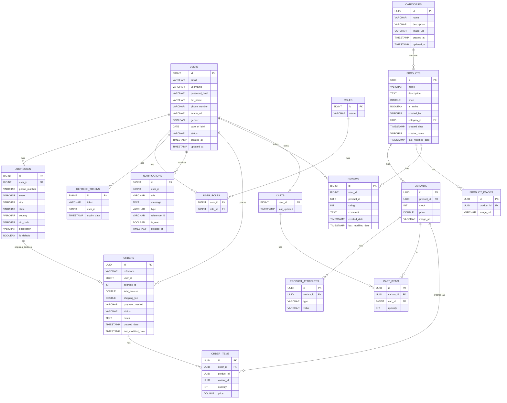

# ERD (Mermaid)

Notes:
1. Các quan hệ bằng `*_id` nhưng trong code đang để kiểu scalar (vd `orders.userId`, `orders.addressId`, `reviews.userId/productId`, `order_items.variantId/productId`, `notifications.userId`, `refresh_tokens.userId`) được thể hiện như “logical FK” trong ERD (vẽ theo ý nghĩa dữ liệu). Nó không đảm bảo DB đang có FK constraint thật.
2. `CartItem` đang dùng `@JoinColumn(name = "cart_id")` trỏ sang `Cart` có PK field là `userId`. Với naming strategy mặc định của Spring (camelCase -> snake_case), cột PK của `carts` thường là `user_id`, nên bạn có thể muốn đổi join column sang `user_id` (hoặc đặt `@Column(name = "cart_id")` cho `Cart.userId`) để tránh lệch tên cột.
